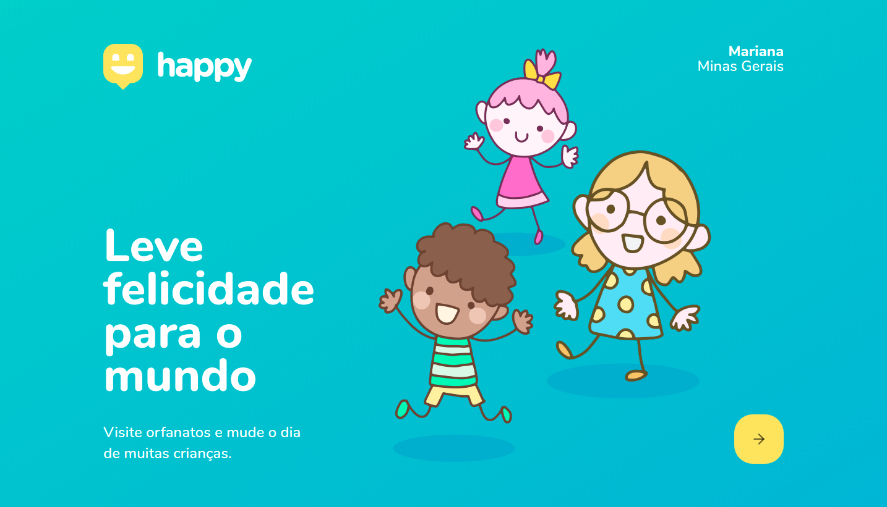
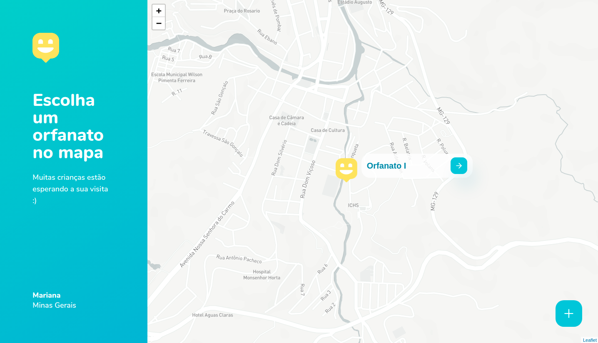
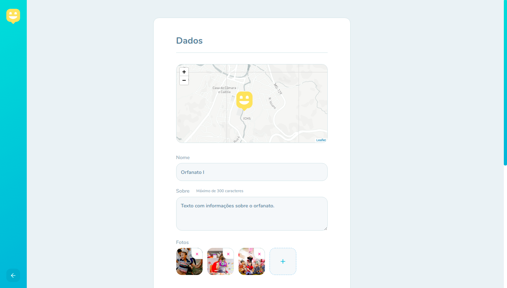
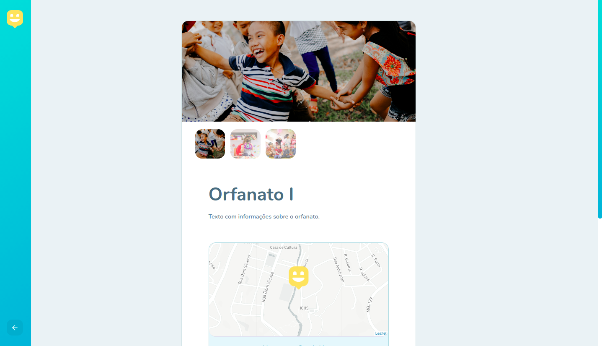

<h1 align="center"> Happy - NextLevelWeek #3 </h1>
<p align="justify">🚀 Esse projeto foi desenvolvido a partir do acompanhamento do workshop NextLevelWeek#3 feito pela <a href="https://rocketseat.com.br/">🔗Rocktseat</a>. Nessa aplicação é possivel cadastrar orfanatos de determinada cidade e visualiza-los através de um mapa.</p>

<p align="center">
  
</p>

<p align="center">
  
</p>

<p align="center">
  
</p>

<p align="center">
  
</p>


```
git clone git@github.com:enyasantos/happy-nlw3.git
cd <web> or <backend>
yarn install
yarn start [web] or yarn dev [backend]
```

To do list
- [x] Página principal.
- [x] Página com o mapa.
- [x] Backend.
- [x] Funcionalidades no frontend web.

Adicionar
- [x] Botão para apagar as imagens.
- [x] Função para apagar as imagens.
- [x] Apagar imagens da pasta uploads quando um orfanato é deletado.
- [] Número do Whatsapp.

